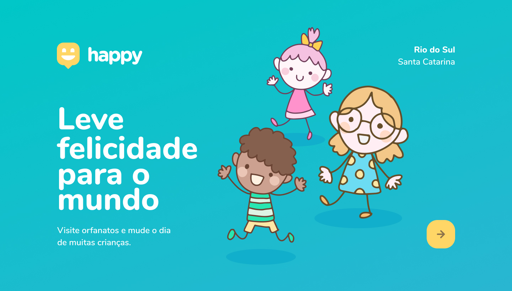

# Happy - Leve a felicidade para o mundo

Projecto criado pela @Rocketseat para a terceira edição do evento Next Level Week.

Com a proposta em fazer pessoas visitarem orfanatos e mudar o dia das crianças.

Tudo em honra ao dia da criança

## Projecto feito com:

### Software

-  Chrome (visualizar o website)
-  Visual Studio Code (editor de código)
-  Figma (Layouts do projecto e prototipação)

### Tecnologias

-  HTML 5 (Estrutura do app)
-  CSS 3 (Estilização do app)
-  JavaScript (Features lógicas)
-  NodeJS (Back-end/Servidor)
-  Knex (ORM)
-  Sqlite3 (Banco de dados)
-  Imagens em formatos (jpg, png e svg)

---

## ABOUT / Gil Vilares

[Instagram](https://instagram.com/vilarezz_)

[Twitter](https://twitter.com/vilarezz)

[Rocketseat](https://app.rocketseat.com.br/me/vilarezz)
